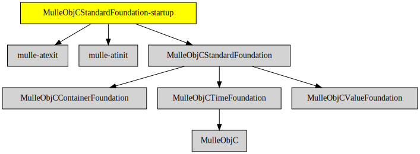

# MulleObjCStandardFoundation-startup

#### ▶️ Startup library for MulleObjCStandardFoundation

This static library provides the required `__register_mulle_objc_universe`
function for executables, that link against
[MulleObjCStandardFoundation](//github.com/MulleFoundation/MulleObjCStandardFoundation).

> Hardly anyone ever does this though, except MulleObjCStandardFoundation tests.

Projects will usually rather link against the
[Foundation](//github.com/MulleFoundation/Foundation) though, and will use
its startup library.


Build Status | Release Version
-------------|-----------------------------------
[](//github.com/MulleFoundation/MulleObjCStandardFoundation-startup/actions) |  [](//github.com/MulleFoundation/MulleObjCStandardFoundation-startup)


## Sourcetree

The main raison d'être of MulleObjCStandardFoundation-startup as a
seperate library is to bequeath the required dependencies
[mulle-atinit](//github.com/mulle-core/mulle-atinit) and
[mulle-atexit](//github.com/mulle-core/mulle-atexit) for linking with the
executable.


### You are here




## Install

See [mulle-foundation-developer](//github.com/MulleFoundation/mulle-foundation-developer) for
installation instructions.


## Build

This is a [mulle-sde]/(//github.com/mulle-sde) project which will
fetch all dependencies and build with `mulle-sde craft`.

### Manually with cmake

Install all prerequisites (use mulle-sde to figure them out) then:

```
(
   mkdir build &&
   cd build &&
   cmake .. &&
   make
)
```


### Platforms and Compilers

All platforms and compilers supported by
[mulle-c11](//github.com/mulle-c/mulle-c11/) and
[mulle-thread](//github.com/mulle-concurrent/mulle-thread/).


## Author

[Nat!](//www.mulle-kybernetik.com/weblog) for
[Mulle kybernetiK](//www.mulle-kybernetik.com) and
[Codeon GmbH](//www.codeon.de)
